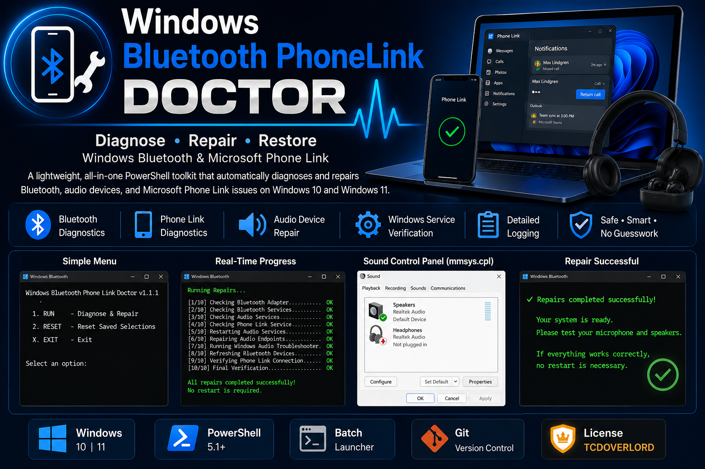
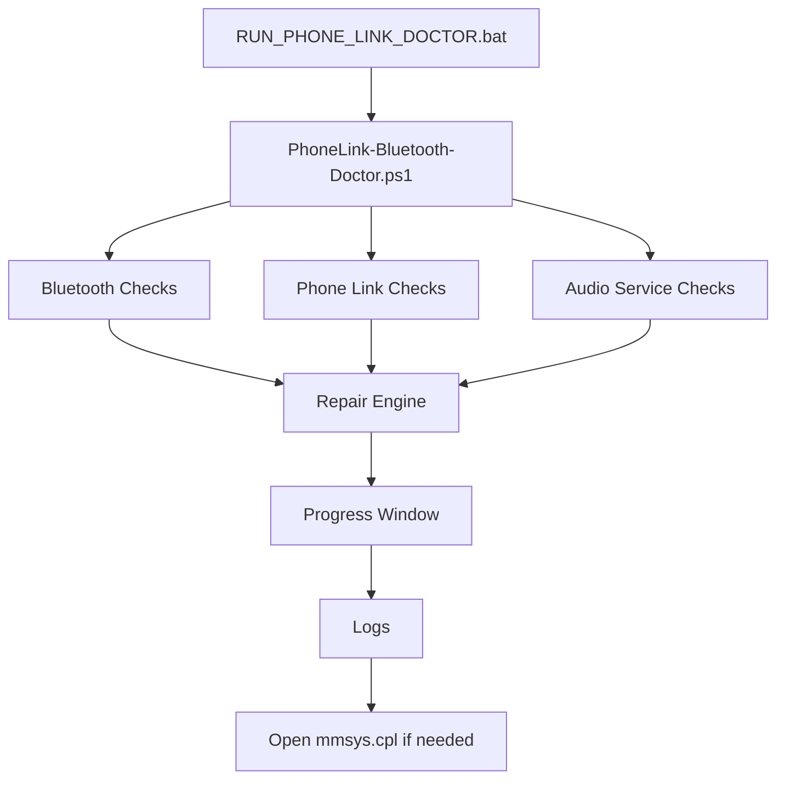

# 📱 Windows Bluetooth PhoneLink Doctor

> **Diagnose • Repair • Restore Windows Bluetooth, Audio, and Microsoft Phone Link**

<p align="center">
  
</p>

## Technology Cards


---

# Overview

Windows Bluetooth PhoneLink Doctor is a Windows diagnostic and repair utility that automates many of the most common Bluetooth, audio, and Microsoft Phone Link troubleshooting steps.

Instead of manually restarting services, navigating multiple settings pages, or guessing which microphone or speakers Windows is using, the tool performs automated checks, attempts safe repairs, records diagnostic logs, and guides you through selecting the correct devices when needed.

---

# Features

- Automated Bluetooth diagnostics and repair
- Microsoft Phone Link diagnostics
- Windows audio service verification
- Simple **RUN / RESET** workflow
- Progress window during repairs
- Diagnostic log generation
- Opens the Windows Sound Control Panel (`mmsys.cpl`) for manual audio selection
- Smart restart recommendations (only when appropriate)

---

# Quick Fix

If audio still isn't working after repairs:

1. Press **Win + R**
2. Type:

```text
mmsys.cpl
```

3. Open the **Recording** tab.
4. Speak into each microphone and watch for the green activity meter.
5. Right-click the correct microphone.
6. Select **Set as Default Device**.
7. Select **Set as Default Communication Device**.
8. Click **Apply** then **OK**.

To change speakers:

1. Open the **Playback** tab.
2. Right-click the correct speakers or headset.
3. Choose **Set as Default Device**.
4. Click **Apply** then **OK**.

---

# Architecture



# Execution Pipeline

```text
Launch
 ↓
Verify Administrator
 ↓
Bluetooth Checks
 ↓
Phone Link Checks
 ↓
Audio Service Checks
 ↓
Run Repairs
 ↓
Generate Logs
 ↓
Complete
```

# Project Tree

```text
Windows-Bluetooth-PhoneLink-Doctor/
├── .gitignore
├── LICENSE
├── README.md
├── RUN_PHONE_LINK_DOCTOR.bat
├── config/
├── images/
├── logs/
└── scripts/
    ├── PhoneLink-Bluetooth-Doctor.ps1
    └── PhoneLink-Progress.ps1
```

# Installation

```powershell
git clone https://github.com/tcdoverlord/Windows-Bluetooth-PhoneLink-Doctor.git
cd Windows-Bluetooth-PhoneLink-Doctor
```

# Quick Start

Double-click:

```text
RUN_PHONE_LINK_DOCTOR.bat
```

Menu options:

- **RUN** — Performs diagnostics and repairs.
- **RESET** — Clears saved audio/device selections so the next RUN starts fresh.
- **EXIT** — Closes the application.

# Logs

Diagnostic logs are written to:

```text
logs/
```

Include the latest log when reporting issues.

# Roadmap

- [x] Simplified RUN / RESET workflow
- [x] Smart restart detection
- [ ] Enhanced Bluetooth diagnostics
- [ ] Additional driver repair options
- [ ] Optional graphical interface

# Version History

## v1.1.1

- Simplified menu to RUN / RESET / EXIT
- Added smart restart recommendations
- Integrated Windows Sound Control Panel guidance
- Improved audio device recovery workflow

# License

This project is licensed under the **TCDOVERLORD Personal Learning License (TPLL) v1.0**.

See the **LICENSE** file for complete terms.

# Author

**TCDOVERLORD**

Building practical Windows utilities, automation tools, diagnostic scripts, and open-source learning projects.

# Support

When opening an issue, include:

- Windows version
- Bluetooth device
- Phone model
- Latest log from `logs/`
- Steps already attempted

## ⭐ Star History

## Star History

[](https://www.star-history.com/?repos=tcdoverlord%2FSafeUSB-Eject-Windows11%2CWindows-Bluetooth-PhoneLink-Doctor%2FWindows-Bluetooth-PhoneLink-Doctor&type=date&legend=top-left)

# Golden Rule

```text
Build
 ↓
Test
 ↓
Document
 ↓
git status
 ↓
git add .
 ↓
git status
 ↓
git commit
 ↓
git push
 ↓
Verify
 ↓
Release
```
